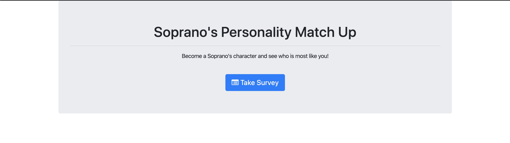
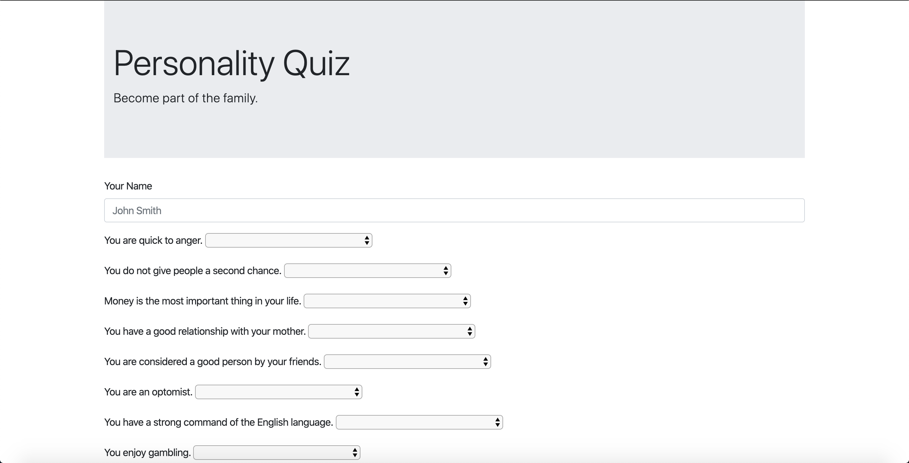

# FriendFinder
## Overview
The Friend Finder app is a miniaturized version of a user matching app. In this version, The user will answer a set of questions and based on the answers, be matched up with the most similar person in the roster of characters. This app is Sopranos Themed, so the user is able to turn themselves into a Sorpano's character by answering Sorpano themed questions.
## How It Works
The user will begin on the home page, which simply explains what the app is. The user will then click the link to the survey. The user must then enter their name, and answer the ten questions provided. Each question has 5 answers with a value between 1-5. 1 means that the question does not relate to the user, and 5 means that the question completely relates to the user. After the user submits their information, the application will count the score the user received and decide which other user in the roster is most similar. It will then present a modal of the name and image of the most similar character.
## Technologies used
This is a full-stack application. It uses node and express primarily. Friend Finder utilizes the Path NPM package to direct traffic through different URL's. For the front end, we use HTML, Jquery, and CSS.
## Role
This is a solo project. As the only developer, I analyzed and interpreted the needs, wants, and requirements of the Product Owner (Trilogy) and created a functioning application from top to bottom that met those expectations.
## Issues
Unfortunately, this application reached a road block. Upon submitting the information on the survey page, the user will recieve a 500 Internal Server Error. I have tried rewriting the script code on the survey page, changing the app.post code on the apiRoutes pages, and have triple checked each page for possible syntax errors. At this moment, no solution has been found. Progress will continue being made until this application is functioning properly.
UPDATE: The Source of the internal server error was found. The only issue being experienced currently is that the modal is not functioning. I am recieving a .modal is not a function response from the console. A quick search online showed that it is normally due to the positioning of the bootstrap link and the jquery link. I followed the guide but nothing changed. Will continue to adjust until functioning.
## Heroku Link
https://dashboard.heroku.com/apps/stormy-brook-76473
## Screenshots

